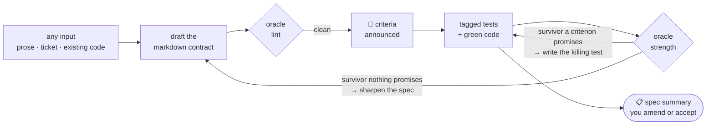

<div align="center">

<picture>
  <source media="(prefers-color-scheme: dark)" srcset="docs/assets/logo-dark.svg">
  <source media="(prefers-color-scheme: light)" srcset="docs/assets/logo.svg">
  
</picture>

**Coverage says your code ran.<br>Speccle says whether your tests would _notice if it broke_.**

<br>

[](LICENSE)


</div>

<br>

## What is Speccle?

Speccle is a **Claude Code plugin** for building features as **vertical slices**. Its
unit of work is the feature folder — one directory owning everything a feature needs,
side by side:

```
checkout/              ← named for the feature, never a catch-all like src/
  SPEC.md              ← acceptance criteria, each with a stable [CHECKOUT-n] id
  CONTEXT.md           ← the feature's language — a glossary
  AGENTS.md            ← how an agent works the slice
  decisions/           ← the feature's ADRs — choices that span criteria
  src/
    checkout.ts
    checkout.test.ts   ← tests claim criteria by carrying the [CHECKOUT-n] token
```

The skills hold the judgement; everything deterministic is delegated to the
`speccle-oracle` CLI, which lints the specs and scores the tests — and **never calls
an LLM**. This matters most when code and tests are AI-generated and review is the
bottleneck: your attention moves up to the spec, and everything downstream is
mechanically attested.

## The loop

Every skill drives the same loop, and it blocks on you exactly once — at plan time,
to agree any **key decision** your input leaves open. Past that, **you own the
criteria**, but ownership is exercised by review, not pre-approval: criteria are
announced the moment they lint clean, and every run ends with a **spec summary** you
can amend or overrule:



A criterion is an H2 heading with a one-line testable **statement**; the body beneath
is free — rationale, edge cases, examples:

```markdown
---
key: CHECKOUT
---

# Checkout

## [CHECKOUT-1] Tax rounds half-up per line item

Tax is computed per line item and rounded half-up to 2dp before summing.

- three items of £1.99 at 20% → £1.20 tax; taxing the £5.97 total would give £1.19
```

A test defends a criterion when the `[CHECKOUT-1]` token appears anywhere in its full
name — so one `describe('[CHECKOUT-1] …')` block claims every test inside it. The full
format is a written contract: [`docs/convention.md`](docs/convention.md).

## The skills

| Skill               | One line                                                                                                                                   |
| ------------------- | ------------------------------------------------------------------------------------------------------------------------------------------ |
| `feature`           | The pipeline: plan → spec → implement → strengthen, ending in one **spec summary**.                                                        |
| `plan-feature`      | Any input → the route (**new** slice, **amend** its owning slice, or a carve) + folder + key, with open **key decisions** agreed together. |
| `spec-feature`      | Draft or amend the markdown contract → lint clean → criteria announced.                                                                    |
| `implement-feature` | A linted spec → tagged tests → green code, one criterion at a time.                                                                        |
| `strengthen`        | Mutation + coverage → per-criterion heatmap → every surviving mutant routed.                                                               |
| `carve-feature`     | Existing code brought under the convention — **without changing it**.                                                                      |

<details>
<summary><strong><code>feature</code></strong> — build or change a slice, end to end</summary>
<br>

The orchestrator and the normal entry point. Takes a feature request in any form —
prose, a ticket, a file — and runs the child skills in order: `plan-feature` routes
the work (a **new** slice, or an **amendment** to the slice that already owns the
behaviour — extending it with new criteria or changing existing ones), `spec-feature`
drafts or amends the contract, `implement-feature` makes it green, and `strengthen`
measures how well the result is defended. The one blocking stop is at plan time —
key decisions your input leaves open are agreed with you, not guessed; there is no
approval step anywhere else, and the run ends with one **spec summary** of every
criterion drafted, amended, or retired, for you to amend or overrule.

Each child is also a skill in its own right: hand a hand-written `SPEC.md` straight
to `implement-feature`, or ask `spec-feature` for a contract with no code yet.

</details>

<details>
<summary><strong><code>strengthen</code></strong> — measure and route</summary>
<br>

Runs mutation testing + coverage and renders the heatmap. Then every **surviving
mutant** is routed on the survivor, never the score:

| The survivor breaks…             | Route                 | What happens                                                                                  |
| -------------------------------- | --------------------- | --------------------------------------------------------------------------------------------- |
| a behaviour a criterion promises | **machine path**      | write the killing test, re-run                                                                |
| something no criterion promises  | **human path**        | draft a sharper criterion, test it — you overrule it in the spec summary if it doesn't belong |
| nothing any test could detect    | **equivalent** (rare) | annotate it in the source                                                                     |

Never a test fitted to a mutant: killing a survivor no criterion promises defends
nothing.

</details>

<details>
<summary><strong><code>carve-feature</code></strong> — govern what already exists</summary>
<br>

Derives the markdown contract from what the code **observably does** — anything
that looks like a bug is a finding for you to rule on in the spec summary, never a
silent fix — then tags the tests that already defend each criterion and writes tests
for what nothing claims. The code's behaviour is unchanged throughout.

</details>

## The heatmap

`oracle strength = killed mutants ÷ covered mutants`, per criterion. Coverage says the
code _ran_; oracle strength says the tests would _notice_. The gap between the two is
the entire point:

```
checkout/SPEC.md
  CHECKOUT-1  ████████████████████  100.0%      4/4  Tax rounds half-up per line item
  CHECKOUT-2  ██████████░░░░░░░░░░   50.0%      2/4  An empty basket totals zero
      checkout/src/checkout.ts:31:9  ArithmeticOperator → a + b
      checkout/src/checkout.ts:44:2  BooleanLiteral → true
  CHECKOUT-3  ░░░░░░░░░░░░░░░░░░░░  unclaimed      0/0  Discounts apply before tax

oracle strength 75.0% (6/8)   line coverage 92.3%
2 surviving mutants — each one a change no test noticed
```

92% of the code ran, but only 75% is defended — and each indented line is the exact
code change no test noticed.

## Install

The plugin installs from GitHub, but the skills shell out to the `speccle-oracle`
binary, so you still need a clone to build it and put it on your `PATH` first. Requires Node ≥ 24;
targets TypeScript projects using vitest, StrykerJS (`perTest` coverage analysis), and
Istanbul `json-summary` coverage.

```sh
git clone https://github.com/matthewalton/speccle.git
cd speccle
pnpm install
pnpm --filter speccle-oracle build
cd packages/oracle && npm link       # puts `speccle-oracle` on your PATH
```

Check it:

```sh
speccle-oracle lint targets/checkout    # → "2 spec files, clean"
```

A target repo that doesn't have the vitest + StrykerJS stack yet gets it in one
command — `speccle-oracle strength init <path>` installs the devDependencies and writes
the preset configs (see the
[oracle README](packages/oracle/README.md#strength-init)).

Then add the plugin to Claude Code:

```
/plugin marketplace add matthewalton/speccle
/plugin install speccle@speccle-marketplace
```

<details>
<summary>No <code>speccle-oracle</code> on your <code>PATH</code>?</summary>
<br>

The skills fall back to running the oracle from the clone's source
(`node <speccle>/packages/oracle/src/cli.ts` — Node ≥ 24 runs TypeScript directly, no
build needed). If they can find neither, they **stop rather than guess**: a spec that
hasn't been linted hasn't been linted.

</details>

## Packages

| Package                              | Role                                                                                                              |
| ------------------------------------ | ----------------------------------------------------------------------------------------------------------------- |
| [`packages/plugin`](packages/plugin) | The Claude Code plugin: the skills. Judgement lives here.                                                         |
| [`packages/oracle`](packages/oracle) | The deterministic tooling the skills invoke: one bin, `lint` and the oracle-strength heatmap. Never calls an LLM. |

## Development

```sh
pnpm install
pnpm --filter speccle-oracle test
pnpm lint
```

Project terminology lives in [`CONTEXT.md`](CONTEXT.md); design decisions in
[`docs/adr`](docs/adr). Working as an agent? Start with [`AGENTS.md`](AGENTS.md);
commit format is in [`.github/CONTRIBUTING.md`](.github/CONTRIBUTING.md).
