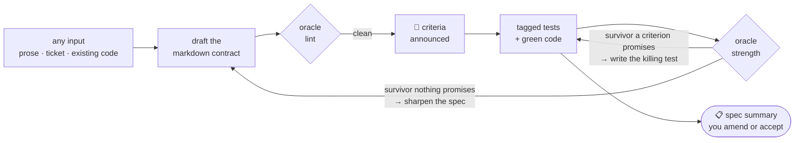

<div align="center">

<picture>
  <source media="(prefers-color-scheme: dark)" srcset="docs/assets/logo-dark.svg">
  <source media="(prefers-color-scheme: light)" srcset="docs/assets/logo.svg">
  
</picture>

**A software factory for Claude Code.<br>An inner loop builds the feature, an outer loop reviews the change,<br>and a meta loop turns every finding into prevention.**

<br>

[](LICENSE)

[](https://www.npmjs.com/package/speccle)


</div>

<br>

## What is Speccle?

Speccle is a software factory for Claude Code — a set of skills plus a `speccle` CLI,
shipped as one npm package you vendor into a repo (or a Claude Code plugin, for just
you). It is built as three nested loops:

- The **inner loop** builds features as **vertical slices** — plan → spec → implement →
  strengthen, closed by a deterministic **checks-gate**. It drives _autonomy_: past one
  planning conversation, the agent runs unattended and commits on green.
- The **outer loop** reviews the **change set** — a panel of lenses over the working
  diff, with fix authority gated by a deterministic risk score. It drives _automation_:
  below your review threshold it fixes what it finds; at or above, a human is required.
- The **meta loop** turns what review found into prevention — every finding is fixed
  and then routed to a durable artefact that stops its class recurring. It drives
  _quality_: the factory's checks, specs, and lenses get sharper with every change that
  ships through it.

The skills hold the judgement; everything deterministic is delegated to the `speccle`
CLI, which **never calls an LLM** (bar the opt-in CI review driver). This matters most
when code and tests are AI-generated and review is the bottleneck: your attention moves
up to the spec and the summaries, and everything downstream is mechanically attested.

## The inner loop — build

The unit of work is the feature folder — one directory owning everything a feature
needs, side by side:

```
checkout/              ← named for the feature, never a catch-all like src/
  SPEC.md              ← acceptance criteria, each with a stable [CHECKOUT-n] id
  CONTEXT.md           ← the feature's language — a glossary
  CLAUDE.md            ← what an agent needs that the folder cannot show
  decisions/           ← the feature's ADRs — choices that span criteria
  src/
    checkout.ts
    checkout.test.ts   ← tests claim criteria by carrying the [CHECKOUT-n] token
```

Every skill drives the same loop, and it blocks on you exactly once — at plan time,
to agree any **key decision** your input leaves open. Past that, **you own the
criteria**, but ownership is exercised by review, not pre-approval: criteria are
announced the moment they lint clean, and every run ends with a **spec summary** you
can amend or overrule:


```mermaid
flowchart LR
    A["any input<br/>prose · ticket · existing code"] --> B["draft the<br/>markdown contract"]
    B --> C{"oracle<br/>lint"}
    C -->|clean| D["📣 criteria<br/>announced"]
    D --> E["tagged tests<br/>+ green code"]
    E --> F{"oracle<br/>strength"}
    F -->|"survivor a criterion promises<br/>→ write the killing test"| E
    F -->|"survivor nothing promises<br/>→ sharpen the spec"| B
    E --> G(["📋 spec summary<br/>you amend or accept"])
```

The pipeline runs **one stage per session**: plan + spec is the attended session — the
pipeline's one human gate — then each criterion is implemented in its own unattended
session that ends at the **checks-gate** (`lint`, `claims`, the test suite, and every
`verify` check the meta loop has written) and commits on green. No state is carried
between sessions: `speccle next` derives the stage from the feature folder itself, so
`/feature` always resumes exactly where the slice really is — the folder is the record.

A criterion is an H2 heading with a one-line testable **statement**; the body beneath
is free — rationale, edge cases, examples:

```markdown
---
key: CHECKOUT
---

# Checkout

## [CHECKOUT-1] Tax rounds half-up per line item

Tax is computed per line item and rounded half-up to 2dp before summing.

- three items of £1.99 at 20% → £1.20 tax; taxing the £5.97 total would give £1.19
```

A test defends a criterion when the `[CHECKOUT-1]` token appears anywhere in its full
name — so one `describe('[CHECKOUT-1] …')` block claims every test inside it. Which
files count as tests, and what counts as a test's name, is the **test dialect**'s
business: TypeScript/vitest and Swift ship today. Where a framework gives a test no
string name, the id takes an identifier-safe spelling instead —
`func test_CHECKOUT_1_taxRounds()` claims the same criterion. The full format is a
written contract: [`docs/convention.md`](docs/convention.md).

## The outer loop — review

The unit changes: not a slice, but a **change set** — the working tree's pending
change, or the commits on a branch. `review` fans a panel of **lenses** (correctness,
security, accessibility, architecture, performance, test-quality, plus any your repo
authors) over it, each an independent subagent, while `speccle risk` scores the change
deterministically. The score gates **fix authority**: below your repo's review
threshold, `review` fixes what it finds — re-running the checks-gate after every fix
and reverting any that turns it red; at or above it, findings stop for a human, and a
risk lens may escalate that line but never lower it. The same lens files also run in CI
on every pull request (`speccle review init`), where they find and comment only, and
`address` closes the loop by acting on the review CI posted — same risk gate, same
checks-gate, fixes pushed back to the pull request's branch.

## The meta loop — reviews that improve the factory

A fix alone means meeting the same finding again next week. So every finding is fixed
**and then routed** — the same posture `strengthen` takes to a surviving mutant — to
whichever loop catches its class next time:

| The class is best caught by…        | Remedy                                       | Where it lands                                         |
| ----------------------------------- | -------------------------------------------- | ------------------------------------------------------ |
| a deterministic invariant           | a **verify check**                           | `.speccle/checks/` — enforced by the inner checks-gate |
| a behaviour the spec should promise | a new **acceptance criterion** + tagged test | the slice's `SPEC.md`                                  |
| judgement at review time            | a **sharpened lens**                         | `.speccle/lenses/` — the next panel                    |

Two durable records make this memory rather than mood. The **remedy record**
(`speccle remedy record` / `recall`) logs each finding, the fix applied, and the
prevention chosen, so a repeat finding is answered the way the first one was. The
**calibration record** (`speccle calibrate`) logs every reviewed change — risk score,
signals fired, and the human's actual verdict — and is the only evidence on which risk
weights and the review threshold move. Speccle reports and proposes; **only a human
acts**, because nothing that reduces supervision may apply itself.

The same two surfaces are yours to extend by hand, and the rule is fixed: a
`.speccle/checks/*.json` check **gates** (deterministic, so it may fail a stage); a
`.speccle/lenses/*.md` lens **advises** (judgement, so it never blocks). A lens in
`.speccle/lenses/plan/` aims at the slice being planned instead of a change set, and
its findings join the plan summary — where you are already ruling on something.

## The skills

| Skill               | One line                                                                                                                                   |
| ------------------- | ------------------------------------------------------------------------------------------------------------------------------------------ |
| `feature`           | The router: asks the folder what stage the slice is at, runs that one stage, names the next command.                                       |
| `plan-feature`      | Any input → the route (**new** slice, **amend** its owning slice, or a carve) + folder + key, with open **key decisions** agreed together. |
| `spec-feature`      | Draft or amend the markdown contract → lint clean → criteria announced.                                                                    |
| `implement-feature` | A linted spec → tagged tests → green code, one criterion at a time.                                                                        |
| `strengthen`        | Mutation + coverage → per-criterion heatmap → every surviving mutant routed.                                                               |
| `carve-feature`     | Existing code brought under the convention — **without changing it**.                                                                      |
| `conform`           | Already-governed slices brought up to the convention after it moves — form only, behaviour never.                                          |
| `review`            | A panel of **lenses** over a change set → risk-gated **find and fix**, every fix re-checked → an overruleable summary.                     |
| `address`           | The review CI posted on a pull request → the same risk-gated fixes → committed **and pushed** to its branch.                               |

<details>
<summary><strong><code>feature</code></strong> — build or change a slice, one stage per session</summary>
<br>

The normal entry point, and a router rather than a pipeline: it asks `speccle next`
what stage the slice is at — derived from the folder, never stored — runs that one
stage, and ends by naming the command for the next session. A feature request in any
form — prose, a ticket, a file — starts at the attended session: `plan-feature` routes
the work (a **new** slice, or an **amendment** to the slice that already owns the
behaviour) and settles open **key decisions** with you, then `spec-feature` drafts or
amends the contract and the criteria are announced in one **spec summary**. Every
session after that is unattended: `implement-feature` takes one criterion end to end,
and the checks-gate commits it on green. Invoke `/feature` again and it resumes
exactly where the folder says the slice is.

Each child is also a skill in its own right: hand a hand-written `SPEC.md` straight
to `implement-feature`, or ask `spec-feature` for a contract with no code yet.

</details>

<details>
<summary><strong><code>strengthen</code></strong> — measure and route</summary>
<br>

Runs mutation testing + coverage and renders the heatmap. Then every **surviving
mutant** is routed on the survivor, never the score:

| The survivor breaks…             | Route                 | What happens                                                                                  |
| -------------------------------- | --------------------- | --------------------------------------------------------------------------------------------- |
| a behaviour a criterion promises | **machine path**      | write the killing test, re-run                                                                |
| something no criterion promises  | **human path**        | draft a sharper criterion, test it — you overrule it in the spec summary if it doesn't belong |
| nothing any test could detect    | **equivalent** (rare) | annotate it in the source                                                                     |

Never a test fitted to a mutant: killing a survivor no criterion promises defends
nothing.

</details>

<details>
<summary><strong><code>carve-feature</code></strong> — govern what already exists</summary>
<br>

Derives the markdown contract from what the code **observably does** — anything
that looks like a bug is a finding for you to rule on in the spec summary, never a
silent fix — then tags the tests that already defend each criterion and writes tests
for what nothing claims. The code's behaviour is unchanged throughout.

</details>

<details>
<summary><strong><code>review</code></strong> — the outer loop, over a change set</summary>
<br>

Speccle's outer loop. Its unit is the **change set** — a branch or the pending change —
not a slice. It fans a panel of **lenses** (correctness, security, accessibility,
architecture, performance, test-quality, and your repo's own **house-conventions** lens)
over the working diff, each an independent subagent. `speccle risk` scores the change and
decides the **fix authority**: below the review threshold `review` fixes what it finds,
re-running the checks-gate after every fix and **reverting — never salvaging — any that
turns it red**; at or above the threshold it reports and stops for a human, and a **risk
lens** may escalate that line but never lower it. It ends with one overruleable summary of
every finding, whether it was fixed, and the **remedy** proposed to stop the class
recurring. The lenses are vendored by `speccle init` into `.speccle/lenses/`; the
house-conventions lens is yours to author, and a refresh never overwrites it.

`review` never pushes — there is no named place for its commit to go. Once the change is
on a pull request and CI has reviewed it, `address` closes the loop.

</details>

<details>
<summary><strong><code>address</code></strong> — clear the review on a pull request</summary>
<br>

The other half of the outer loop, after the pull request. Where `review` derives findings,
`address` acts on the ones CI already posted: `speccle review findings` reads them back,
the same risk gate decides fix authority, the same checks-gate guards every fix — and the
surviving fixes are committed **and pushed to the pull request's branch**, because here
there is a named place for them to go.

You don't look up the number: it reads the pull request off the current branch, and you can
name one to override that. With **no posted review it stops and says so** rather than
quietly running a local panel — you asked to act on a review someone already paid for, and a
second panel on the same commit can reach a different answer than the one you read.

It also records the calibration entry CI cannot: whether the change **needed** a human is
your answer, and the review threshold only moves on it.

</details>

## The heatmap

`oracle strength = killed mutants ÷ covered mutants`, per criterion. Coverage says the
code _ran_; oracle strength says the tests would _notice_. The gap between the two is
the entire point:

```
checkout/SPEC.md
  CHECKOUT-1  ████████████████████  100.0%      4/4  Tax rounds half-up per line item
  CHECKOUT-2  ██████████░░░░░░░░░░   50.0%      2/4  An empty basket totals zero
      checkout/src/checkout.ts:31:9  ArithmeticOperator → a + b
      checkout/src/checkout.ts:44:2  BooleanLiteral → true
  CHECKOUT-3  ░░░░░░░░░░░░░░░░░░░░  unclaimed      0/0  Discounts apply before tax

oracle strength 75.0% (6/8)   line coverage 92.3%
2 surviving mutants — each one a change no test noticed
```

92% of the code ran, but only 75% is defended — and each indented line is the exact
code change no test noticed.

## Install

Speccle is two pieces and you need both: the **skills**, which hold the judgement and
run inside Claude Code, and the **`speccle` CLI**, which the skills shell out to
for everything deterministic. Requires Node ≥ 24.

The contract, the lint and the claim join reach every supported test dialect —
TypeScript/vitest and Swift today. The oracle-strength heatmap additionally needs
TypeScript with vitest, StrykerJS (`perTest` coverage analysis) and Istanbul
`json-summary` coverage.

### 1. The CLI

```sh
npm i -g speccle
speccle lint    # lints every SPEC.md under the current directory
```

Global is the simplest way to have it everywhere, but the skills resolve the oracle
three ways and take the first that answers: the repo's own
`node_modules/.bin/speccle`, then your `PATH`, then a clone. **A repo that pins
its own version wins** — that pin is a committed choice, and lint rules change between
releases, so a team all lints the same way. If they can't find the oracle at all they
**stop rather than guess** — a spec that hasn't been linted hasn't been linted.

So you can skip this step entirely if every repo you work in provisions its own
(step 3) — bootstrap the first one with `npx speccle strength init`.

### 2. The skills — one of two ways

**Project-level** — vendor them into the repo so the whole team gets the pipeline by
cloning; commit what lands. With the CLI installed (step 1), from the repo root:

```sh
speccle init   # → .claude/skills/ + .speccle/lenses/ + .speccle/checks/ + .speccle/config.json, all committed
```

`init` materializes the skills and the review lenses from the CLI's own tarball, so
`speccle@X` names one skill↔oracle pairing — nothing to drift. It also records the repo's
test facts in `.speccle/config.json` and scaffolds the two extension surfaces —
`.speccle/checks/` and `.speccle/lenses/plan/` — with a README each. Re-run it any time
to refresh as a reviewable diff; your own house-conventions lens, checks, and plan
lenses are never overwritten.

**User-level** — the plugin, for just you, across all your projects:

```
/plugin marketplace add matthewalton/speccle
/plugin install speccle@speccle-marketplace
```

Don't do both — two copies of every skill would load; `speccle init` warns if it sees
both.

### 3. The strength stack — per target repo, only for the heatmap

```sh
speccle strength init
```

Installs the devDependencies and writes the preset configs (see the
[oracle README](packages/oracle/README.md#strength-init)). Skip it if you only want the
contract, the lint and the claim join — those need nothing but the CLI.

### 4. Review in CI — opt-in

`review` runs in a session with no key at all; that's the on-ramp. The same lenses can also
run on every pull request, which needs a metered key and so is never set up for you:

```sh
speccle review init
```

That writes one file — `.github/workflows/speccle-review.yml` — pinned to the CLI version
you ran it with. Then add an `ANTHROPIC_API_KEY` repo secret, and protect `.github/` with
CODEOWNERS: anyone who can edit a workflow can read the secrets it uses.

On a pull request it fans `.speccle/lenses/` over the change set, posts the findings as one
review with inline comments, and reports the risk verdict as a status check. It **finds and
comments only** — fixes come back through the local skill, which re-runs the checks-gate and
reverts what goes red. Whether a failing check blocks the merge is branch protection: your
setting, not Speccle's.

Fork pull requests are skipped (they must not reach the key), the reviewing code is fetched
from npm rather than the branch under review, and one automatic review is posted per pull
request — comment `@review` to run it again. Re-run `speccle review init` to move the pin.

## Updating

Three moving parts — the CLI, the vendored skills, and the strength stack — plus the CI
review driver if you opted into it, and only the CLI updates silently. That is deliberate:
the skills and the stack become **your repo's files**, so changing them is a diff you
review, never something that happens behind you.

Two commands drive it, and neither ever touches your global install:

```sh
speccle doctor   # what's stale? CLI version, skills and lenses, the CI driver's pin, stack drift
speccle update   # refresh the vendored skills and lenses forward; print the CLI + stack fix commands
```

| Part                      | How                                                                            | What you get                                     |
| ------------------------- | ------------------------------------------------------------------------------ | ------------------------------------------------ |
| **CLI, global**           | `npm i -g speccle@latest`                                                      | Silent — it's a binary, not your code            |
| **CLI, repo-pinned**      | Bump `speccle` in the repo's `devDependencies`                                 | A lockfile diff to review and commit             |
| **Skills, project-level** | `speccle update` (or re-run `speccle init`)                                    | A diff of `.claude/skills/` to review and commit |
| **Skills, user-level**    | `/plugin marketplace update` then `/plugin update speccle@speccle-marketplace` | Applies on restart                               |
| **Strength stack**        | `speccle doctor` names the drift; run the `npm install` `update` prints        | The reconcile command — you run it               |
| **CI review driver**      | `speccle review init` (only if you opted in); `update` moves an existing pin   | A diff of the workflow to review and commit      |

Bumping the CLI is **two steps, in order**: `npm i -g speccle@latest` for the new binary
and its bundled skills, **then** `speccle update` to refresh the vendored skills to match.
`update` prints the `npm i -g` line rather than running it — it can't reach your global
install, so it never self-updates the binary. The skills ride inside the CLI's tarball, so
`speccle@X` is one skill↔oracle pairing; run `update` before bumping the CLI and it just
re-materializes the skills you already have.

The two install paths carry **the same version number at each release**, so `speccle@0.15.0`
on npm and `speccle@0.15.0` from the marketplace are the same skills. Between releases the
plugin's number can be ahead — its cache is keyed by version, so a skill change has to bump
it right away — and npm's history skips those numbers.

The strength stack stays a config you own — `strength init` never overwrites a
`stryker.config.json` you've customised — but `doctor` now flags when yours has drifted
from the current preset (a major behind, a missing devDependency), and `update` prints the
exact `npm install` to reconcile. The preset fields are documented in the
[oracle README](packages/oracle/README.md#strength-init).

<details>
<summary>Running the oracle from a clone instead</summary>
<br>

Contributors, and anyone who'd rather not install globally, can skip step 1: the skills
fall back to running the oracle from a clone's source
(`node <speccle>/packages/oracle/src/cli.ts` — Node ≥ 24 runs TypeScript directly, so
no build step).

```sh
git clone https://github.com/matthewalton/speccle.git
cd speccle && pnpm install
```

</details>

## Packages

| Package                              | Role                                                                                                                                                                                         |
| ------------------------------------ | -------------------------------------------------------------------------------------------------------------------------------------------------------------------------------------------- |
| [`packages/plugin`](packages/plugin) | The Claude Code plugin: the skills. Judgement lives here.                                                                                                                                    |
| [`packages/oracle`](packages/oracle) | The deterministic tooling the skills invoke: one bin — `lint`, `claims`, `next`, `verify`, `risk`, `remedy`, `calibrate`, and the oracle-strength heatmap. No LLM, bar the opt-in CI driver. |

## Development

```sh
pnpm install
pnpm --filter speccle test
pnpm lint
```

Project terminology lives in [`CONTEXT.md`](CONTEXT.md); design decisions in
[`docs/adr`](docs/adr). Working as an agent? Start with [`CLAUDE.md`](CLAUDE.md);
commit format is in [`.github/CONTRIBUTING.md`](.github/CONTRIBUTING.md).
